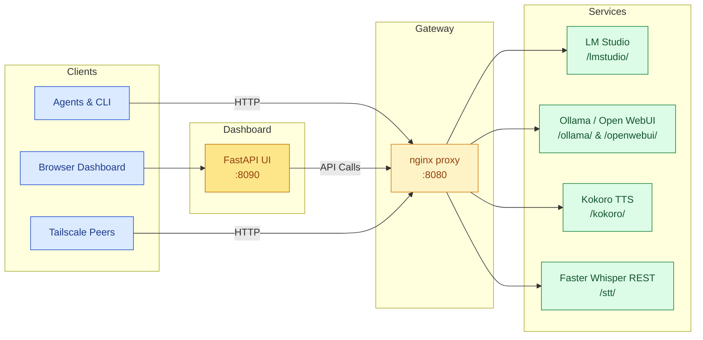

# AI Hub Workspace

Modern LLM stacks rarely live in isolation. This repository packages the tooling used to operate the “AI Hub” gateway on a single machine, exposing local services like LM Studio, Ollama, Kokoro TTS, and Faster Whisper to teammates over a secure network. The dashboard, scripts, and proxy are designed to be publish-ready so you can share the project publicly without leaking private infrastructure.

---

## Highlights

- **Unified Gateway** – nginx fronts each upstream (`/lmstudio/`, `/ollama/`, `/kokoro/`, `/openwebui/`, `/stt/`), keeping private ports off the network.
- **Agent-Friendly Dashboard** – FastAPI UI documents every service, provides live payload builders, and enforces optional API keys.
- **Reference Clients** – Python scripts under `dashboard/scripts/` exercise all endpoints, now automatically loading `.env` for consistent configuration.
- **Audio Pipeline** – Kokoro TTS and Faster Whisper REST share the same OpenAI-compatible schema for easy swapping in agent workflows.
- **Docker OR Bare Metal** – Containers orchestrate the full stack, but the utilities run fine on a local virtual environment without Docker.

---

## Architecture



---

## Repository Layout

- `dashboard/` – FastAPI app, static assets, and reference scripts (`ai_agent_example.py`, `connectivity_check.py`).
- `proxy/` – Lightweight nginx configuration that exposes the gateway.
- `docker-compose.yml` – Spins up the dashboard, gateway, and audio services in one command.
- `install/` – Virtualenv bootstrap scripts for server and client roles.
- `requirements/` – Pinned dependency sets used by the installers.
- `faster-whisper-data/`, `openwebui-data/`, … – Data directories populated on first run (kept out of Git).

---

## Quick Start

1. **Clone and prepare `.env`:**
   ```bash
   git clone <repo-url> && cd aihub
   cp .env.example .env
   ```
   - Set `LAN_IP` (or overwrite with `AIHUB_IP`) to the machine’s reachable address.
   - Optionally define `DASHBOARD_API_KEYS` (comma-separated) to require an `X-API-Key`.
   - Populate any model defaults (`LMSTUDIO_MODEL`, `OLLAMA_MODEL`, `KOKORO_VOICE`, etc.).

2. **Run the full stack with Docker:**
   ```bash
   docker compose up -d
   docker ps --format 'table {{.Names}}\t{{.Status}}'
   ```
   The `proxy` container listens on port `8080`, and the dashboard lives on `8090`.

3. **Access the dashboard:**  
   Visit `http://<AIHUB_IP>:8090` (or use the `tailnet-ip` published in `.env`). Paste your dashboard API key into the header field if authentication is enabled.

4. **Verify the gateway:**  
   ```bash
   source .venv-client/bin/activate       # if using the client venv
   python dashboard/scripts/connectivity_check.py
   ```
   The script now reads `.env` automatically. Use CLI flags (`--ip`, `--lmstudio-model`, etc.) to override defaults.

---

## Services at a Glance

| Service ID            | Gateway Path                          | Notes                                                                    |
|-----------------------|---------------------------------------|--------------------------------------------------------------------------|
| `lmstudio-chat`       | `/lmstudio/v1/chat/completions`       | Chat-style completions using LM Studio’s OpenAI-compatible API.          |
| `lmstudio-responses`  | `/lmstudio/v1/responses`              | “Responses” endpoint for flexible prompt execution.                      |
| `lmstudio-completions`| `/lmstudio/v1/completions`            | Legacy text completions.                                                 |
| `lmstudio-embeddings` | `/lmstudio/v1/embeddings`             | Vector embeddings for retrieval workflows.                               |
| `openwebui-chat`      | `/openwebui/api/chat/completions`     | Delegates chat requests to Open WebUI (backed by Ollama).                |
| `gateway-ollama-chat` | `/ollama/v1/chat/completions`         | Direct gateway relay to Ollama without WebUI tooling.                    |
| `kokoro-tts`          | `/kokoro/v1/audio/speech`             | Text-to-speech; returns MP3 audio.                                       |
| `faster-whisper-stt`  | `/stt/v1/audio/transcriptions`        | Speech-to-text via Faster Whisper REST.                                  |

All requests accept `X-API-Key` when the dashboard is locked down. Additional provider parameters (temperature, tools, streaming, etc.) are passed straight through the gateway.

---

## Scripts & Utilities

- `dashboard/scripts/ai_agent_example.py`
  - Demonstrates every major endpoint (models list, chat, responses, completions, embeddings, TTS, STT).
  - Loads `.env` automatically; override runtime options with flags such as `--host`, `--lmstudio-model`, or `--dashboard-api-key`.
  - Example usage:
    ```bash
    python dashboard/scripts/ai_agent_example.py --host 100.64.194.12 --dashboard-api-key <key>
    ```

- `dashboard/scripts/connectivity_check.py`
  - Performs a full health sweep and reports HTTP status, latency, and result summaries.
  - Accepts `--mode` (`server`, `client`, `all`), or let defaults read from `.env`.

- `scripts/rebuild_services.sh`
  - Simple wrapper around `docker compose build` + `docker compose up -d`.
  - Pass service names (`proxy-gateway`, `aihub_dashboard`, etc.) to rebuild selectively.

---

## Configuration Reference

| Variable                 | Purpose                                                                                     |
|--------------------------|---------------------------------------------------------------------------------------------|
| `LAN_IP` / `AIHUB_IP`    | Host IP advertised to clients; defaults to `127.0.0.1`.                                     |
| `GATEWAY_PORT`           | nginx gateway port (default `8080`).                                                        |
| `LMSTUDIO_MODEL`         | Default model for LM Studio chat/completion calls (`qwen3-0.6b` by default).                |
| `LMSTUDIO_EMBEDDING_MODEL`| Embedding model used by demos (`text-embedding-qwen3-embedding-0.6b`).                    |
| `OLLAMA_MODEL`           | Default Ollama/Open WebUI model (`gemma3:4b`).                                              |
| `KOKORO_VOICE`           | Default Kokoro voice (`af_bella`).                                                          |
| `OPENWEBUI_API_KEY`      | Bearer token for Open WebUI when authentication is enabled.                                 |
| `DASHBOARD_API_KEYS`     | Comma-separated list of keys accepted by the dashboard and gateway (`X-API-Key` header).    |
| `AGENT_TIMEOUT`          | Request timeout used by the agent example (seconds).                                        |

Any value present in `.env` is now automatically injected into the helper scripts at runtime.

---

## Troubleshooting

- **401 from Open WebUI** – Set `OPENWEBUI_API_KEY` in `.env` or pass `--openwebui-api-key`. The gateway relays headers transparently.
- **Embeddings 404** – Ensure the embedding-capable model is actually “served” inside LM Studio. Re-download if loading was interrupted.
- **Audio uploads rejected** – FastAPI endpoints allow up to `200 MB` for STT and `50 MB` for TTS through nginx; adjust `proxy/nginx.conf` if needed.
- **Gateway reachable but empty responses** – Run `python dashboard/scripts/connectivity_check.py --mode all` to confirm each upstream is healthy, then inspect container logs (`docker compose logs -f <service>`).
- **Missing env values in scripts** – `ai_agent_example.py` and `connectivity_check.py` now load `.env` automatically, but they preserve existing environment variables; export overrides before running if you need different settings for a single session.

---

## Contributing

1. Fork the repository and create a feature branch.
2. Keep configuration declarative—extend `SERVICES` in `dashboard/app.py` and update `dashboard/AGENTS.md` when new endpoints join the catalog.
3. Run the connectivity check and agent example to validate changes before opening a pull request.
4. Avoid committing secrets: redact API keys, IPs, and generated logs before publishing.

---

## License

This project is licensed under the MIT License. See [`LICENSE`](LICENSE) for details.
